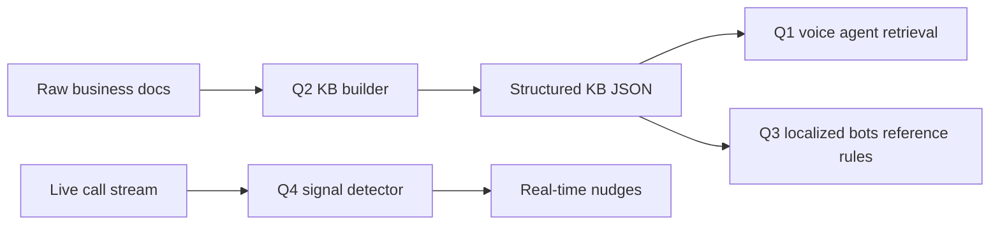

# AI Workflow Prototypes

This repository is organized around four production-style AI workflow questions:

- `q1-voice-agent`: knowledge-grounded voice agent
- `q2-knowledge-base`: production-ready knowledge base
- `q3-localized-bots`: native-language voice bots for the Philippines and Indonesia
- `q4-live-insights`: live call insights and nudges

The goal is to keep the implementation practical, explainable, and easy to evaluate. Each section includes:

- the problem analysis
- the intended solution approach
- implementation notes
- test and evidence expectations

## What is in place

- A clean folder structure for all four questions
- An assessment breakdown in `docs/assessment-analysis.md`
- Question-specific READMEs that describe the architecture and execution plan

## How to use this repo

1. Start with `docs/assessment-analysis.md` to understand the business requirements.
2. Open the README inside the question you want to work on.
3. Add implementation code, test artifacts, and evidence inside that question folder.
4. Keep recordings, transcripts, screenshots, and outputs inside `evidence/`.

## Build order

1. `q2-knowledge-base`
2. `q1-voice-agent`
3. `q3-localized-bots`
4. `q4-live-insights`

## Quick run guide

```powershell
cd q2-knowledge-base
python .\src\cli.py build
python .\src\cli.py test

cd ..\q1-voice-agent
python .\src\cli.py test

cd ..\q3-localized-bots
python .\src\cli.py test

cd ..\q4-live-insights
python .\src\cli.py benchmark

cd ..
python .\tools\regression_matrix.py

cd demo-server
python .\src\server.py --host 127.0.0.1 --port 8088
```

The regression matrix currently covers 81 happy-path, edge-case, grounding, localization, live-nudge, and stress cases.

## Manual Demo URLs

After starting the demo server:

- Overview: `http://127.0.0.1:8088/`
- Q1 voice agent web calling interface with mic, playback, recording, transcript save: `http://127.0.0.1:8088/q1`
- Q2 knowledge-base retrieval: `http://127.0.0.1:8088/q2`
- Q3 localized bots: `http://127.0.0.1:8088/q3`
- Q4 live insights: `http://127.0.0.1:8088/q4`

## Suggested delivery standard

The final submission should feel like a real project, not a demo stub:

- grounded answers instead of prompt-heavy hallucination
- traceable knowledge sources
- localized language behavior
- measurable latency and reliability
- clear fallback and escalation paths

## Architecture



## Prototype Boundary

This submission is a local working prototype. Q1 includes a browser voice interface using microphone input, browser speech playback, transcript history, and recording save support. A real phone number integration still requires a telephony provider credential. Production integration points are documented in `docs/production-improvement-plan.md`.
