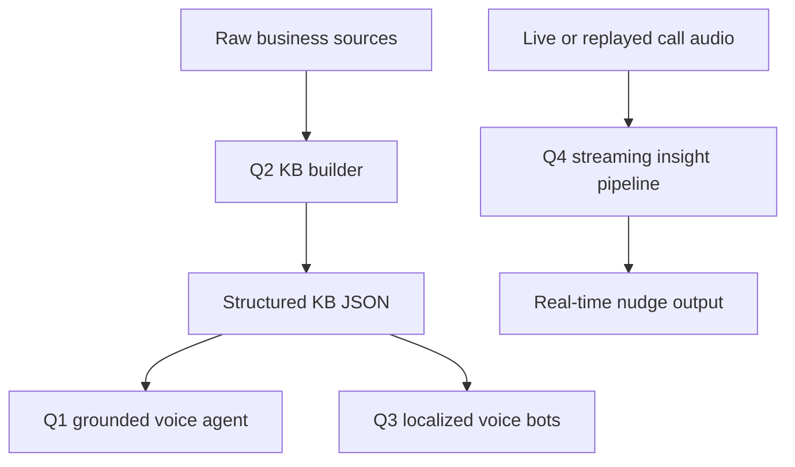

# Architecture Overview

## Overall system

## Design principle

The main design choice is to keep source of truth separate from generation:

- Q2 owns the canonical knowledge structure.
- Q1 consumes that knowledge and stays grounded.
- Q3 focuses on language and market realism.
- Q4 focuses on live signal extraction and timing.

